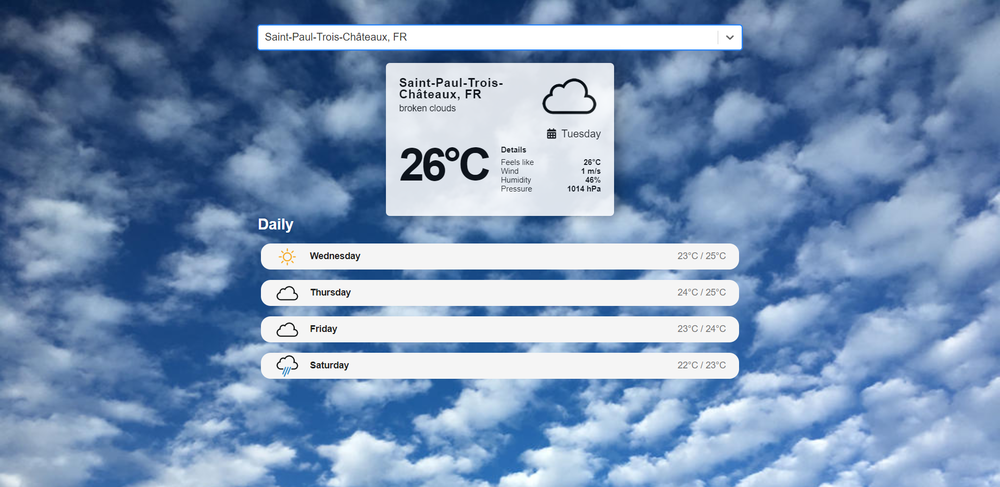
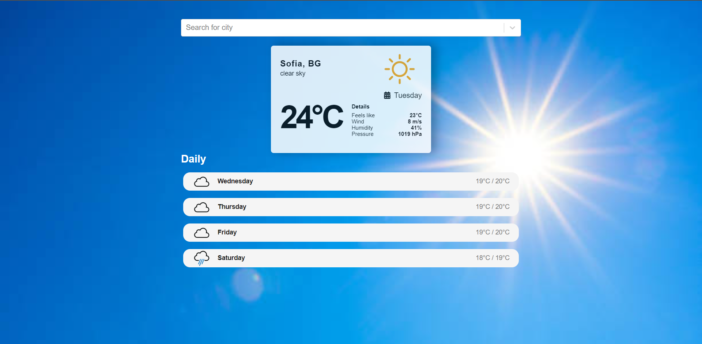
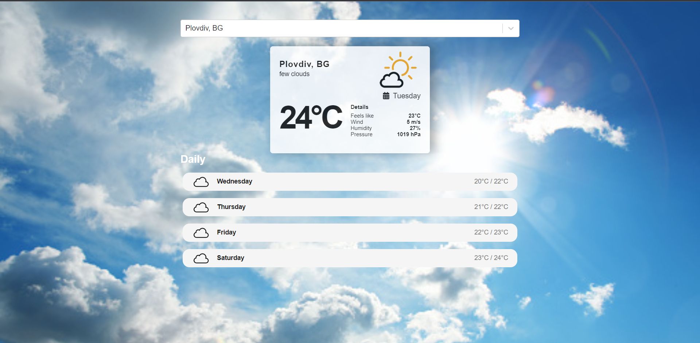
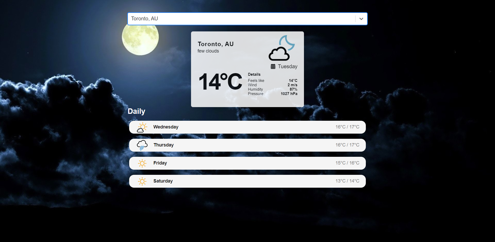
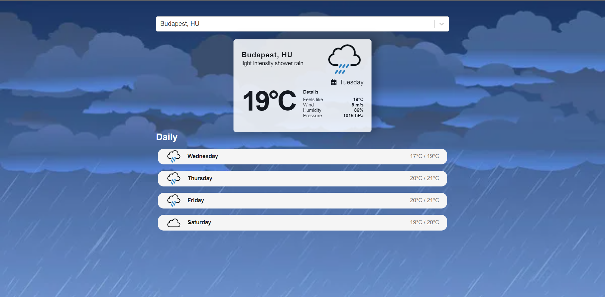
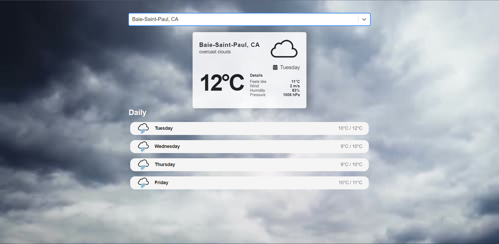
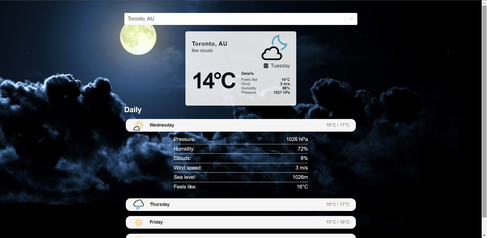

# 🌞Weather-App

This is a weather app, which shows daily and 4 days ahead the weather about current city

# 💻Technologies

 - ReactJS
 - HTML
 - CSS
 - API - (one API to get cities, and one to get Weather)
 
 
 # ⚙️Functionality
 
  - Daily weather forecast
  - 4-day weather forecast
  - Search city by name
  - Changing background

# 👀Screenshots

</img>
</img>
</img>
</img>
</img>
</img>
</img>

# 🏆Feedback 

Thank you for viewing my project.If you have any questions, you can find contant information in my profile.
